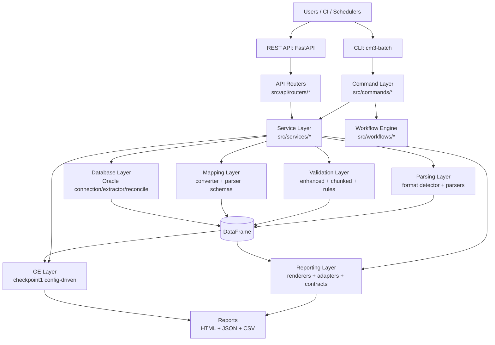
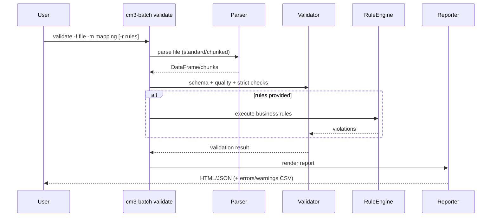

# Architecture

## High-Level Architecture

## Validation Flow

## Core Modules
- `src/main.py` — CLI wiring
- `src/commands/` — thin command handlers
- `src/services/` — shared business workflows (CLI/API parity)
- `src/workflows/` — shared workflow orchestration engine for scripts
- `src/parsers/` — format detection and parsing
- `src/parsers/enhanced_validator.py` — standard validation
- `src/parsers/chunked_validator.py` — chunked validation
- `src/validators/` — business and field validators
- `src/database/` — Oracle connectivity and extraction
- `src/contracts/` — typed config contracts (pipeline/workflow)
- `src/reports/` — unified report rendering/adapters/contracts
- `src/reporters/` + `src/reporting/` — backward-compatible shims (deprecated)
- `src/quality/gx_checkpoint1.py` — Great Expectations checkpoint integration

## Design Principles
- Mapping-driven processing (no hardcoded file layouts)
- Fail-fast exit codes for CI correctness
- Memory-safe chunked processing for large files
- Service-first reuse to prevent CLI/API drift
- Human + machine outputs for operations and automation
- Contract-first report payloads (v1 JSON schemas under `docs/contracts/*.schema.json`)

## Current Compliance Snapshot (2026-02-21)
- ✅ Compare path uses shared service (`src/services/compare_service.py`) from both CLI and API.
- ✅ Workflow scripts are thin wrappers over stage-based workflow engine (`src/workflows/engine.py`).
- ✅ Reporting contract docs + v1 schemas are published for validation and compare outputs.
- ✅ API supports sync + async compare and strict/chunked validate parity.
