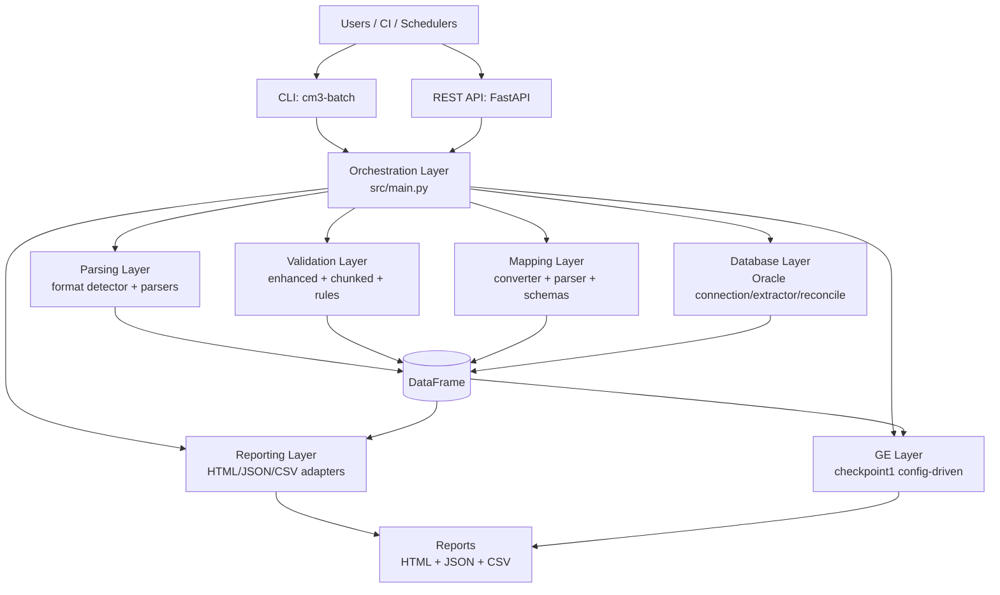
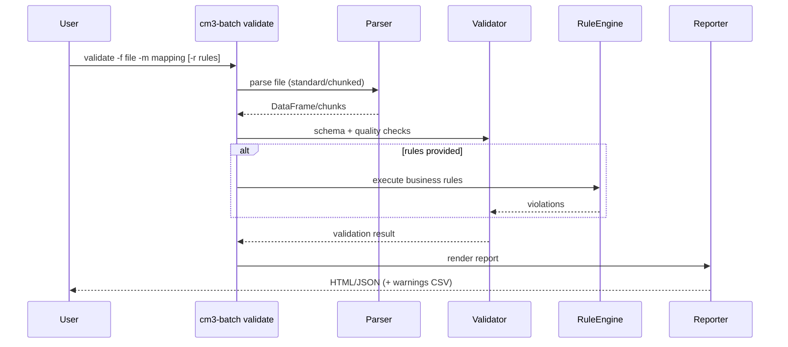

# Architecture

## High-Level Architecture

## Validation Flow

## Core Modules
- `src/main.py` — command orchestration
- `src/parsers/` — format detection and parsing
- `src/parsers/enhanced_validator.py` — standard validation
- `src/parsers/chunked_validator.py` — chunked validation
- `src/validators/` — business and field validators
- `src/database/` — Oracle connectivity and extraction
- `src/reports/` — unified report rendering/adapters/contracts
- `src/reporters/` + `src/reporting/` — backward-compatible shims (deprecated)
- `src/quality/gx_checkpoint1.py` — Great Expectations checkpoint integration

## Design Principles
- Mapping-driven processing (no hardcoded file layouts)
- Fail-fast exit codes for CI correctness
- Memory-safe chunked processing for large files
- Human + machine outputs for operations and automation
