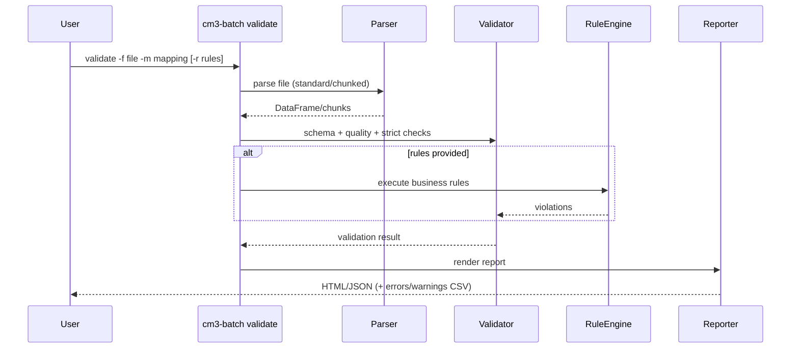

# Architecture

## High-Level Architecture

```mermaid
flowchart TD
    U[Users / CI / Schedulers] --> C[CLI: cm3-batch]
    U --> A[REST API: FastAPI]
    U --> WEB[Web UI\n/ui single-page app]
    WEB --> A

    BATCH[Java Batch Process] -->|trigger file| WATCH[cm3-batch watch]
    BATCH -->|webhook| RUNS[/api/v1/runs/trigger]

    C --> CMDS[Command Layer\nsrc/commands/*]
    A --> API[API Routers\nsrc/api/routers/*]

    WATCH --> SVCS[Service Layer\nsrc/services/*]
    RUNS --> SVCS

    CMDS --> SVCS
    API --> SVCS

    CMDS --> WF[Workflow Engine\nsrc/workflows/*]

    SVCS --> P[Parsing Layer\nformat detector + parsers]
    SVCS --> V[Validation Layer\nenhanced + chunked + rules]
    SVCS --> M[Mapping Layer\nconverter + parser + schemas]
    SVCS --> D[Database Layer\nOracle connection/extractor/reconcile]
    SVCS --> R[Reporting Layer\nrenderers + adapters + contracts]
    SVCS --> G[GE Layer\ncheckpoint1 config-driven]

    P --> DF[(DataFrame)]
    V --> DF
    M --> DF
    D --> DF
    DF --> R
    DF --> G

    R --> OUT[Reports\nHTML + JSON + CSV]
    G --> OUT
```

## Validation Flow

```mermaid
sequenceDiagram
    participant User
    participant CLI as cm3-batch validate
    participant Parser
    participant Validator
    participant Rules as RuleEngine
    participant Reporter

    User->>CLI: validate -f file -m mapping [-r rules]
    CLI->>Parser: parse file (standard/chunked)
    Parser-->>CLI: DataFrame/chunks
    CLI->>Validator: schema + quality + strict checks
    alt rules provided
      CLI->>Rules: execute business rules
      Rules-->>Validator: violations
    end
    Validator-->>CLI: validation result
    CLI->>Reporter: render report
    Reporter-->>User: HTML/JSON (+ errors/warnings CSV)
```

## Core Modules
- `src/main.py` — CLI wiring
- `src/commands/` — thin command handlers
- `src/services/` — shared business workflows (CLI/API parity)
- `src/workflows/` — shared workflow orchestration engine for scripts
- `src/parsers/` — format detection and parsing
- `src/parsers/enhanced_validator.py` — standard validation
- `src/parsers/chunked_validator.py` — chunked validation
- `src/validators/` — business and field validators
- `src/database/` — Oracle connectivity and extraction
- `src/contracts/` — typed config contracts (pipeline/workflow)
- `src/reports/` — unified report rendering/adapters/contracts
- `src/reporters/` + `src/reporting/` — backward-compatible shims (deprecated)
- `src/quality/gx_checkpoint1.py` — Great Expectations checkpoint integration

**Web UI**: Single-page HTML UI at `/ui`. Vanilla JS calls existing API endpoints. No framework or build step. Run history logged to `reports/run_history.json`.

**API Check Testing**: `api_check` test type in YAML suites calls external HTTP endpoints via `httpx` and asserts on status code and JSON response. Integration tests in `tests/integration/` cover all FastAPI endpoints using `TestClient`.

**CI/CD Integration**: `cm3-batch watch` polls a trigger directory for `.trigger` files dropped by the Java batch process and runs the matching suite automatically. `POST /api/v1/runs/trigger` provides a webhook for pipeline-based triggering. Templates in `ci/` for GitLab CI and Azure DevOps.

**Row tracking**: All parsers append `__source_row__` (1-indexed physical line number) to output DataFrames. This column is preserved through the comparison and reporting layers and stripped before Oracle operations.

## Design Principles
- Mapping-driven processing (no hardcoded file layouts)
- Fail-fast exit codes for CI correctness
- Memory-safe chunked processing for large files
- Service-first reuse to prevent CLI/API drift
- Human + machine outputs for operations and automation
